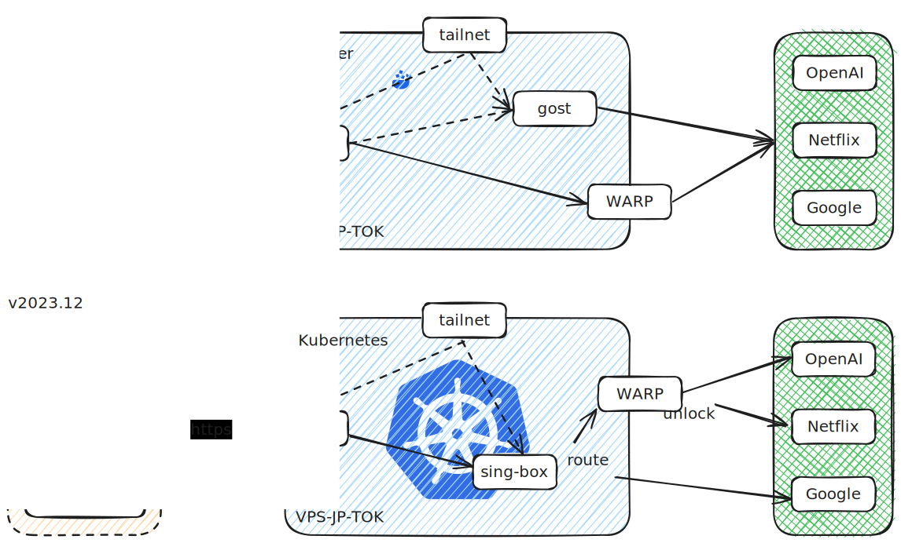

# 科学上网



**首先，我们先明确一下，我科学上网的目的主要是为了学习、工作、交友、查资料、和丰富自己的眼界，不是其它的事。**

---

组件 | 版本 | 说明
--- | --- | ---
[gost](https://github.com/go-gost/gost) | `v3.0.0` | 一个非常强的代理服务
[sing-box](https://github.com/SagerNet/sing-box) | `v1.7.6` | 新一代的通用代理平台
[Cloudflare WARP](https://blog.cloudflare.com/introducing-cloudflare-warp/) | `1.1.1.1` | Cloudflare 出品的虚拟私人网络（VPN）服务，访问原生 IP
[k3s](https://github.com/k3s-io/k3s) | `v1.29.0+k3s1` | 轻量级的 Kubernetes 发行版
[helm](https://github.com/helm/helm) | `v3.13.3` | Kubernetes 包管理工具
[ingress-nginx](https://github.com/kubernetes/ingress-nginx) | `v1.9.5` | Nginx Ingress Controller
[cert-manager](https://github.com/cert-manager/cert-manager) | `v1.13.3` | 自动化托管 TLS 证书
[reloader](https://github.com/stakater/Reloader) | `v1.0.56` | 监测 ConfigMap/Secret 的变化，滚动更新 Deployment

## TL;DR;

### 环境准备

```bash
# install k3s
curl -sfL https://get.k3s.io | INSTALL_K3S_VERSION="v1.29.0+k3s1" INSTALL_K3S_EXEC="--disable traefik --disable metrics-server" sh -
mkdir -p ~/.kube || ln -s /etc/rancher/k3s/k3s.yaml ~/.kube/config

# install helm
curl https://raw.githubusercontent.com/helm/helm/main/scripts/get-helm-3 | bash

# install ingress-nginx
helm upgrade --install ingress-nginx ingress-nginx \
  --repo https://kubernetes.github.io/ingress-nginx \
  --namespace ingress-nginx --create-namespace \
  --set controller.ingressClassResource.default=true --set controller.watchIngressWithoutClass=true \
  --set controller.kind=DaemonSet --set controller.service.type=LoadBalancer \
  --set controller.extraArgs.enable-ssl-passthrough=true

# install cert-manager
helm upgrade --install cert-manager cert-manager \
  --repo https://charts.jetstack.io \
  # https://charts.bitnami.com/bitnami \
  --namespace cert-manager --create-namespace \
  --version v1.13.3 --set installCRDs=true

# install reloader
kubectl apply -f https://raw.githubusercontent.com/stakater/Reloader/master/deployments/kubernetes/reloader.yaml
```

### 部署服务

```bash
grep -n '<CHANGE_YOUR_' ./templates/*.yaml
sed -i 's/<CHANGE_YOUR_EMAIL>/YOUR_EMAIL/g' ./templates/*.yaml
sed -i 's/<CHANGE_YOUR_DOMAIN>/YOUR_DOMAIN/g' ./templates/*.yaml

kubectl create ns proxynet
kubectl apply -f ./templates
```

## 参考链接

- https://github.com/haoel/haoel.github.io
- https://github.com/chise0713/warp-reg.sh
